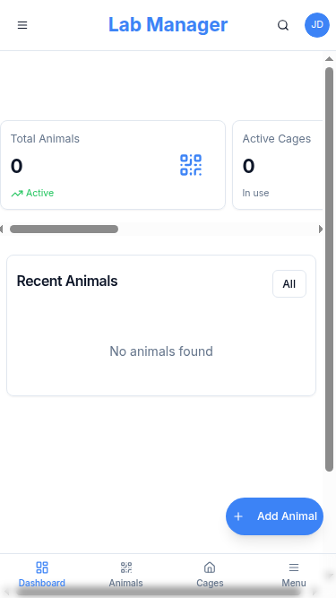

# 🚀 PASO A PASO DETALLADO - NEON.TECH + TU PROYECTO

## ✅ YA TIENES CUENTA EN NEON.TECH - PERFECTO!

Ahora sigue estos pasos exactos:

---

## 📋 PASO 1: CREAR PROYECTO EN NEON.TECH

1. **Ve a tu Dashboard de Neon**: https://console.neon.tech/app/projects
   
2. **Haz clic en "New Project"** (botón verde en la esquina superior derecha)

3. **Configura tu proyecto**:
   - **Project name**: `animal-lab-db` (o el nombre que prefieras)
   - **Region**: Selecciona el más cercano a ti (ej: US East, Europe West)
   - **Postgres version**: Deja la que viene por defecto (16)
   
4. **Haz clic en "Create Project"**

5. **¡ESPERA!** La página te mostrará la información de conexión.

---

## 📋 PASO 2: COPIAR LA URL DE CONEXIÓN

1. En la página que aparece después de crear el proyecto, verás una sección que dice **"Connection string"**

2. **IMPORTANTE**: Verás varias opciones (Pooled, Direct, etc). Usa **"Pooled connection"**

3. **Copia la URL completa** que se ve así:
   ```
   ******user:password@host.region.neon.tech/dbname?sslmode=require
   ```

4. **GUÁRDALA** en un lugar seguro (notepad, notes, etc). La necesitarás en el siguiente paso.

---

## 📋 PASO 3: CONFIGURAR TU PROYECTO

### Opción A: Usar el Script Automático (RECOMENDADO) ✨

1. **Abre tu terminal** en el directorio del proyecto

2. **Ejecuta el script de configuración**:
   ```bash
   node setup-neon.js
   ```

3. **Pega tu DATABASE_URL** cuando te lo pida

4. **¡Listo!** El script configurará todo automáticamente.

### Opción B: Configuración Manual

1. **Crea el archivo `.env`** en la raíz del proyecto (si no existe)

2. **Pega este contenido**, REEMPLAZANDO la URL con la tuya:
   ```env
   # Reemplaza esta URL con la que copiaste de Neon
   DATABASE_URL="******user:password@host.region.neon.tech/dbname?sslmode=require"

   # Session secret (genera uno aleatorio en producción)
   SESSION_SECRET="animal-lab-secret-change-in-production-$(date +%s)"

   # Configuración del servidor
   PORT=5000
   NODE_ENV=development
   HOST=0.0.0.0
   ```

3. **Guarda el archivo**

---

## 📋 PASO 4: INSTALAR DEPENDENCIAS

En tu terminal, ejecuta:

```bash
npm install
```

Esto tomará unos minutos. Verás un montón de texto, es normal.

Deberías ver al final:
```
added 640 packages
```

---

## 📋 PASO 5: CREAR LAS TABLAS EN LA BASE DE DATOS

Ejecuta:

```bash
npm run db:push
```

Deberías ver:
```
✓ Pushing schema...
✓ Done!
```

¡Tus 11 tablas ya están creadas en Neon! 🎉

---

## 📋 PASO 6: CREAR TU USUARIO ADMINISTRADOR

Ejecuta:

```bash
node create-admin.js
```

Te pedirá información. Ejemplo:

```
Email: tu@email.com
Nombre: Juan
Apellido: Pérez
Contraseña: ******** (mínimo 8 caracteres)
Confirmar contraseña: ********
```

Deberías ver:
```
✓ Admin user created successfully!
```

---

## 📋 PASO 7: ¡EJECUTAR TU PROYECTO!

```bash
npm run dev
```

Verás algo como:
```
[vite] dev server running at http://localhost:5000
[express] serving on http://0.0.0.0:5000
```

---

## 📋 PASO 8: ABRIR EN EL NAVEGADOR

1. Abre tu navegador favorito (Chrome, Firefox, Safari, Edge)

2. Ve a: **http://localhost:5000**

3. Deberías ver la página de login de tu proyecto

4. **Inicia sesión** con:
   - Email: el que usaste en create-admin
   - Contraseña: la que configuraste

---

## 🎉 ¡LISTO! YA ESTÁ FUNCIONANDO

Ahora verás:
- ✅ Dashboard con estadísticas
- ✅ Gestión de animales
- ✅ Gestión de jaulas
- ✅ Códigos QR
- ✅ Todas las funcionalidades completas

---

## 🔧 SI ALGO SALE MAL

### Error: "Cannot find module"
```bash
rm -rf node_modules package-lock.json
npm install
```

### Error: "DATABASE_URL must be set"
- Verifica que el archivo `.env` existe
- Verifica que la DATABASE_URL está correctamente escrita
- Asegúrate de que NO hay espacios antes o después del `=`

### Error: "Failed to connect to database"
- Verifica que copiaste la URL completa de Neon
- Asegúrate de que incluye `?sslmode=require` al final
- Verifica que tu proyecto de Neon está activo

### Error: "Port 5000 already in use"
Cambia el puerto en `.env`:
```env
PORT=3000
```

### El login no funciona
- Asegúrate de que ejecutaste `node create-admin.js`
- Verifica el email y contraseña
- Intenta crear otro usuario admin

---

## 📱 ACCEDER DESDE TU MÓVIL

1. **Averigua tu IP local**:
   ```bash
   # En Mac/Linux:
   ifconfig | grep "inet " | grep -v 127.0.0.1
   
   # En Windows:
   ipconfig
   ```

2. **En tu móvil**, abre el navegador y ve a:
   ```
   http://TU-IP-LOCAL:5000
   ```
   Ejemplo: `http://192.168.1.100:5000`

---

## 🌐 DESPLEGAR EN INTERNET (GRATIS)

### Vercel (Más Fácil)

```bash
# Instalar Vercel CLI
npm i -g vercel

# Desplegar
vercel

# Cuando te pregunte por variables de entorno, agrega:
# DATABASE_URL = tu url de neon
# SESSION_SECRET = un string aleatorio
```

---

## 📸 CAPTURAS DE LO QUE VERÁS

### 1. Pantalla de Login


### 2. Dashboard Principal


### 3. Vista de Animales


### 4. Vista de Jaulas


### 5. Códigos QR


---

## ✅ CHECKLIST COMPLETO

Marca cada paso conforme lo completes:

- [ ] Cuenta creada en Neon.tech
- [ ] Proyecto creado en Neon
- [ ] DATABASE_URL copiada
- [ ] Archivo `.env` creado y configurado
- [ ] `npm install` ejecutado exitosamente
- [ ] `npm run db:push` ejecutado (tablas creadas)
- [ ] `node create-admin.js` ejecutado (admin creado)
- [ ] `npm run dev` ejecutado (servidor corriendo)
- [ ] Navegador abierto en http://localhost:5000
- [ ] Login exitoso
- [ ] Dashboard visible
- [ ] Funcionalidades probadas

---

## 🆘 NECESITAS MÁS AYUDA?

Si tienes algún error o problema:

1. **Revisa esta guía** desde el principio
2. **Lee el mensaje de error** completo
3. **Busca el error** en la sección "SI ALGO SALE MAL"
4. **Copia el error exacto** y búscalo en Google
5. **Crea un issue** en GitHub con el error completo

---

## 🎯 RESUMEN ULTRA RÁPIDO

```bash
# 1. Ya tienes cuenta en Neon ✓
# 2. Crea proyecto, copia DATABASE_URL
# 3. Ejecuta script automático:
node setup-neon.js
# (Pega tu DATABASE_URL cuando te lo pida)

# 4. O configura manualmente .env con tu DATABASE_URL
# 5. Luego ejecuta:
npm install
npm run db:push
node create-admin.js
npm run dev

# 6. Abre: http://localhost:5000
# 7. Login con tus credenciales
```

---

**¡Ya tienes todo lo que necesitas para ver tu proyecto funcionando!** 🎉

Si sigues estos pasos exactamente, en menos de 10 minutos tendrás tu sistema de gestión de laboratorio corriendo. 🔬🐭
